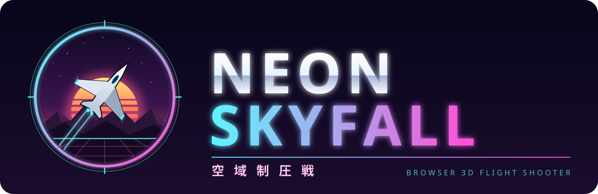

# NEON SKYFALL — 空域制圧戦

HTML1枚で動作するブラウザ3Dフライトシューティングゲームです（Three.js 使用）。

▶ **プレイ:** https://sskrc.github.io/Solana-Hackathon-Web3D/

## 特徴
- 手続き生成の山岳地形・水面・夕焼けの空とブルーム等のポストエフェクト
- 4種の敵（ドローン / インターセプター / ガンシップ / ボス）とウェーブ制
- ロックオン式ホーミングミサイル、レーダー、コンボスコア
- WebAudio によるリアルタイム生成の効果音・BGM

## 操作
| 入力 | 動作 |
|---|---|
| マウス | 機首操作（照準） |
| 左クリック | パルスレーザー |
| 右クリック / Space | ホーミングミサイル |
| W / S | スロットル |
| A / D | スライド移動 |
| Shift | ブースト |
| Esc / P | ポーズ |

## ローカルで遊ぶ
`index.html` をブラウザで開くだけです（Three.js を CDN から読み込むためネット接続が必要）。
